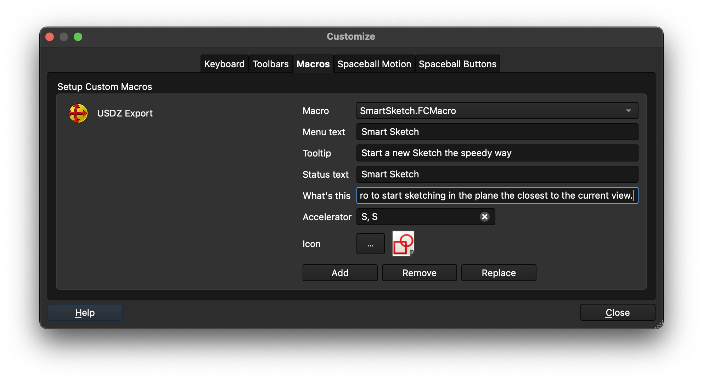

# SmartSketch

A FreeCAD macro that creates a sketch on the plane nearest to your current viewport — and keeps the view facing the direction you chose.

## Quick Start

1. **Edit → Preferences → Addon Manager → Custom repositories** → add `https://github.com/chevdor/freecad-addon-smart-sketch` with branch `master` → OK, then open **Tools → Addon Manager**, search for *SmartSketch* and click Install
2. Switch to **Part Design**, rotate the viewport toward the face you want to sketch on
3. Press **S, S** — done

If this saves you 5 minutes a day, consider [buying me a coffee](https://ko-fi.com/chevdor) ☕ — it helps keep these things coming.

## Demo

**Before — built-in sketch creation always snaps the viewport to Front, even if you were looking at the Back. Same issue for Left (snaps to Right) and Bottom (snaps to Top):**

**After — SmartSketch preserves the viewing direction, snaps to the nearest plane automatically (no need to be perfectly aligned), and skips the plane selection dialog entirely for a lightning fast workflow:**

## The Problem

FreeCAD's built-in sketch creation always snaps the viewport to the **front** side of the plane, regardless of how you were looking at the model.

**Example:**
1. Orient the viewport to see the **Rear** of your model (numpad `4`)
2. Create a sketch → select the XZ plane
3. FreeCAD snaps the viewport to **Front** ✗

You then have to manually re-orient back to Rear before you can draw. This is tedious and breaks the flow, especially when working on the back, bottom, or sides of a part.

## What This Macro Does

SmartSketch replaces that workflow with a single action:

1. Orient the viewport roughly toward the face you want to sketch on — Front, Rear, Top, Left, whatever. You don't need to be perfectly aligned, just close enough.
2. Press **S, S**
3. The sketch opens immediately — correct plane, correct direction ✓

Key behaviours:

- **No plane selection dialog** — the nearest plane is chosen automatically, so you go straight into the sketch
- **No need to be perfectly aligned** — any view roughly facing a plane is enough; SmartSketch snaps to the closest one
- **View is preserved** — looking at the Back? The sketch opens from the Back
- **Body auto-created** — if no PartDesign Body exists in the document, one is created automatically

For special cases — like attaching a sketch to the face of an existing solid — fall back to the standard New Sketch (**S, K**), which lets you pick any face or plane manually.

Internally, SmartSketch sets **Map Reversed** on the sketch when you are looking at the back side of a plane, then forces the viewport back to your original direction after FreeCAD's built-in auto-alignment fires.

## Installation & Setup

### 1. Install via Addon Manager

1. **Edit → Preferences → Addon Manager → Custom repositories** → add `https://github.com/chevdor/freecad-addon-smart-sketch`, branch `master` → OK
2. **Tools → Addon Manager** → search for *SmartSketch* → click **Install**

For alternative install methods see the [official macro installation guide](https://wiki.freecad.org/How_to_install_macros).

### 2. Register the macro

1. **Macro → Macros…** → select `SmartSketch` → click **Run** once to confirm it works

### 3. Add the keyboard shortcut

1. **Tools → Customize → Macros** tab
2. Select `SmartSketch.FCMacro` from the Macro dropdown, fill in Menu text, Tooltip, etc.
3. Set the Accelerator to **S, S**
4. Click **Add**

`S, S` — mnemonic: **S**mart **S**ketch. (Or **S**uper **S**peedy, if you ask us.)

### 4. Add to toolbar *(optional)*

1. **Tools → Customize → Toolbars** tab
2. Select or create a custom toolbar (e.g. *My Tools*), set Category to **Macros**
3. Find *SmartSketch* on the left, click **→** to add it to the toolbar → OK

## Compatibility

Tested on FreeCAD 1.x. Requires FreeCAD ≥ 0.20.
