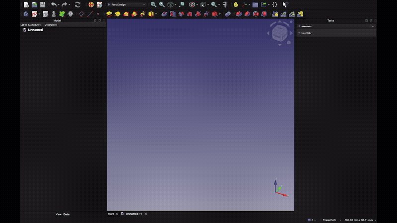

# SmartSketch

A FreeCAD macro that creates a sketch on the plane nearest to your current viewport — and keeps the view facing the direction you chose.

## Demo

**Before — built-in sketch creation always snaps the viewport to Front, even if you were looking at the Back. Same issue for Left (snaps to Right) and Bottom (snaps to Top):**

**After — SmartSketch preserves the viewing direction:**

## The Problem

FreeCAD's built-in sketch creation always snaps the viewport to the **front** side of the plane, regardless of how you were looking at the model.

**Example:**
1. Orient the viewport to see the **Rear** of your model (numpad `4`)
2. Create a sketch → select the XZ plane
3. FreeCAD snaps the viewport to **Front** ✗

You then have to manually re-orient back to Rear before you can draw. This is tedious and breaks the flow, especially when working on the back, bottom, or sides of a part.

## What This Macro Does

SmartSketch replaces that workflow with a single action:

1. Orient the viewport however you like (Front, Rear, Top, Bottom, Left, Right)
2. Run the macro
3. The sketch is created on the nearest plane, the view stays **exactly where you put it** ✓

Internally it does two things to achieve this:

- Sets **Map Reversed** on the sketch when you are looking at the back side of a plane, so the sketch normal faces you
- Forces the viewport back to your original direction after FreeCAD's built-in auto-alignment fires

If no PartDesign Body exists in the document, one is created automatically.

## Installation

Follow the official FreeCAD documentation:
[How to install macros](https://wiki.freecad.org/How_to_install_macros)

The short version: copy (or symlink) `SmartSketch.FCMacro` into your FreeCAD macro directory, then use **Macro → Macros…** to run it once to confirm it works.

## Recommended Shortcut

Bind the macro to **S, S** (chord: press S then S) via **Tools → Customize → Keyboard**.

`S, S` — mnemonic: **S**mart **S**ketch.

## Compatibility

Tested on FreeCAD 1.x. Requires FreeCAD ≥ 0.20.
